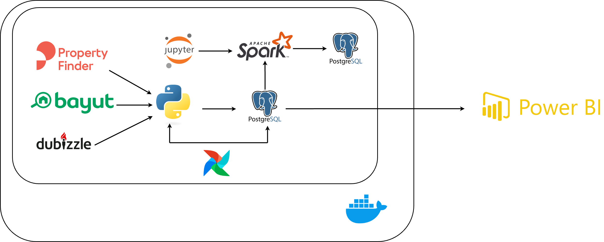

# 🏘️ Property Price Prediction and Analysis

This project is an end-to-end data engineering pipeline designed to collect, process, and analyze property listings from **Property Finder**, **Bayut**, and **Dubizzle**, focusing on **El Sheikh Zayed City** in Egypt. It aims to deliver accurate real estate price predictions and valuable insights using modern data stack technologies.

---

## 🚀 Overview

- Scraped **100,000+ property listings** using **Scrapy** from Property Finder, Bayut, and Dubizzle.
- Cleaned, transformed, and stored data using **PostgreSQL**, **Apache Spark**, and **Python**.
- Managed and orchestrated ETL processes via **Apache Airflow**.
- Performed exploratory data analysis and built **regression models in PySpark**.
- Visualized insights and predictions in **Power BI dashboards**.

---

## 🛠 Tech Stack

| Tool / Language      | Usage                              |
|----------------------|------------------------------------|
| Python               | Scripting and scraping             |
| Scrapy               | Web scraping framework             |
| Apache Airflow       | Workflow orchestration             |
| Apache Spark         | Data transformation and modeling   |
| PostgreSQL           | Data storage                       |
| Power BI             | Data visualization                 |
| Docker               | Containerization                   |
| Jupyter Notebook     | EDA and Model development          |

---

## 📊 Features

- **Real estate market insights**: Gain visibility into property prices, trends, and hotspots.
- **Price prediction model**: Built using Spark MLlib with R² score > 0.85.
- **Real-time dashboard**: Filter properties by location, price, and more via Power BI.
- **Fully containerized**: Portable and reproducible using Docker.

---
